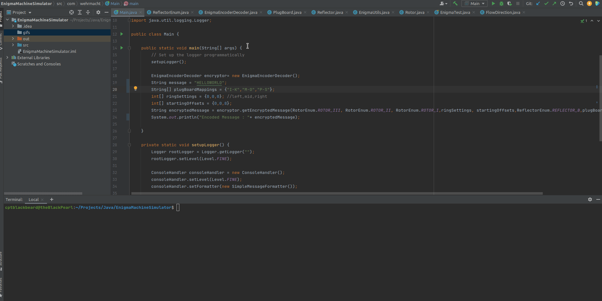
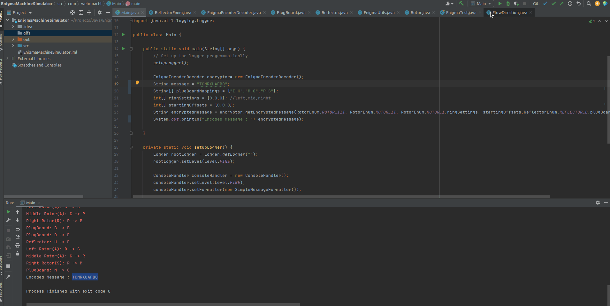

# Enigma Machine Simulator

This project is a Java-based simulation of the Enigma machine, a cipher device used by the German military during World War II.

## Features

- Simulates the Enigma machine with multiple rotors and reflectors.
- Customizable plugboard for additional letter swaps.
- Supports multiple rotor configurations and reflectors.
- Allows user to input their own settings for rotor positions, ring settings, and plugboard mappings.

## Getting Started

### Read more about the actual machine
I really recommend reading and understanding the concepts behind the actual machine before jumping into the code or attempting modifications of anysort.
I have used this [How did the Enigma Machine work?](https://www.youtube.com/watch?v=ybkkiGtJmkM) video to learn a lot about the intricasies of the workings of the machine.
More details of the machine can be found from this [resource](https://www.cryptomuseum.com/crypto/enigma/working.htm).

### Prerequisites

- Java 8 or higher
- Maven (for dependency management)

### Demo

1. Here is a demo of the encryption from the application
   

   
2. Here is a demo of the dencryption from the application,
   note that the same pluboard mappings, ringsettings,rotor offsets ,rotors,rotor order is used for the decryption.
   
